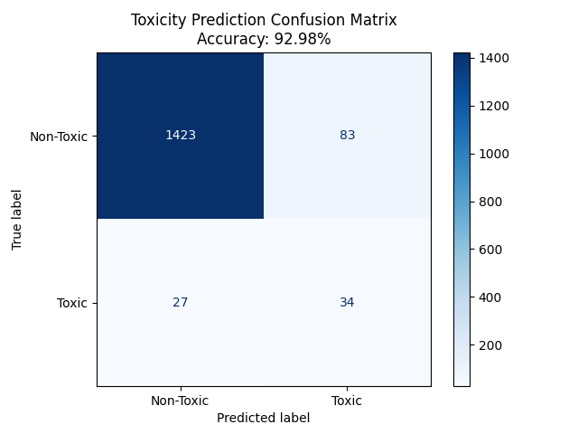

# Codecure-AI-Toxicity

## Model Performance
- **Accuracy:** 92.98%
- **Algorithm:** Random Forest Classifier

## Visualization

## Overview
This project predicts drug toxicity to ensure healthcare safety using AI.
